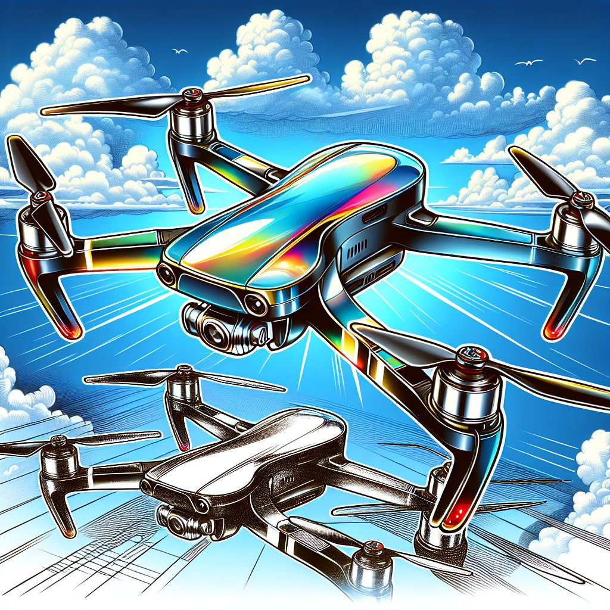
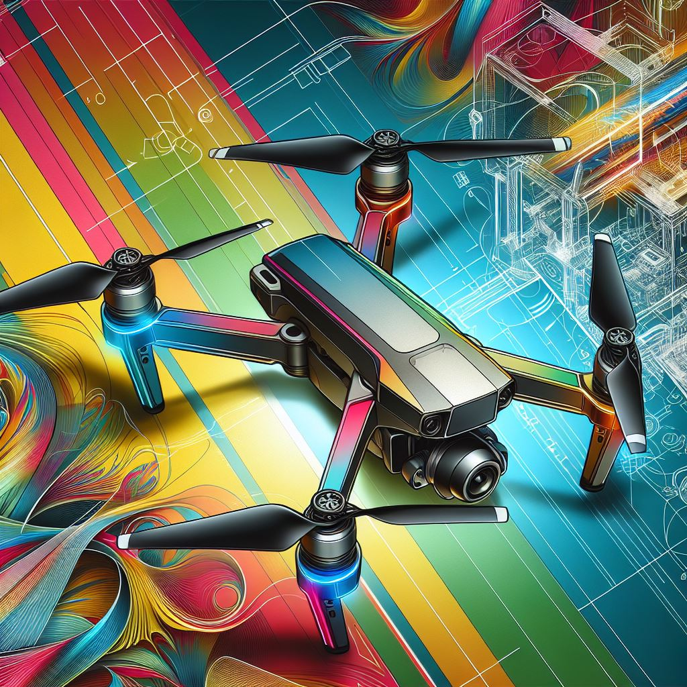
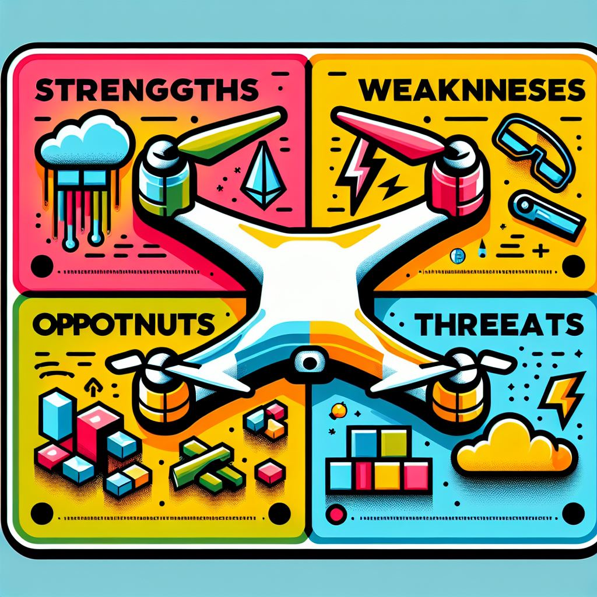
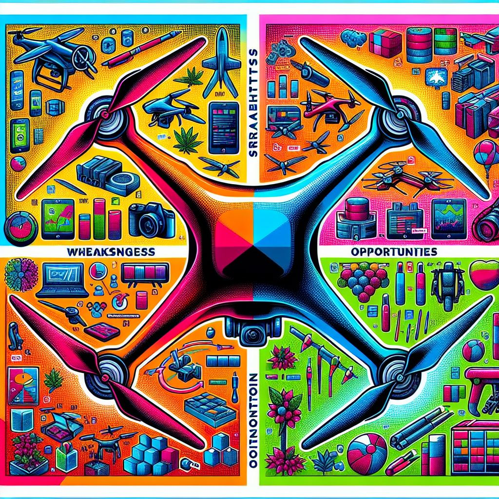
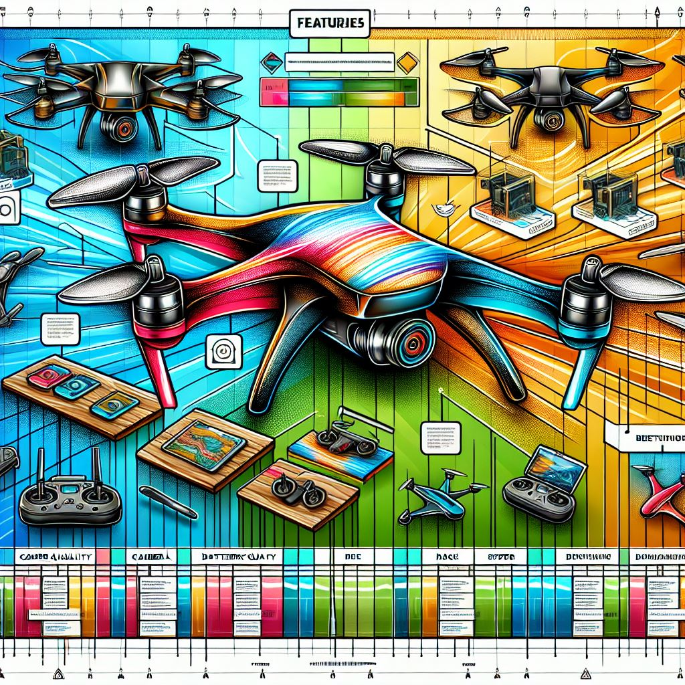
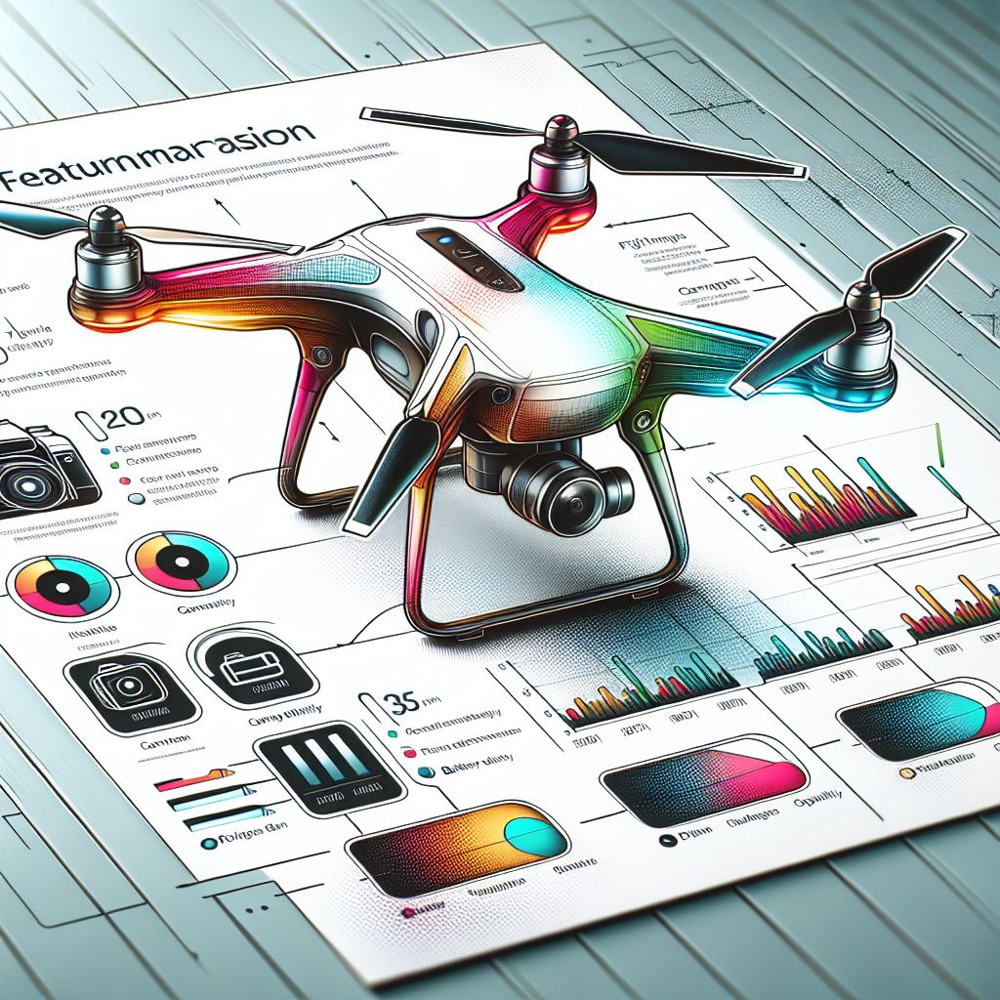
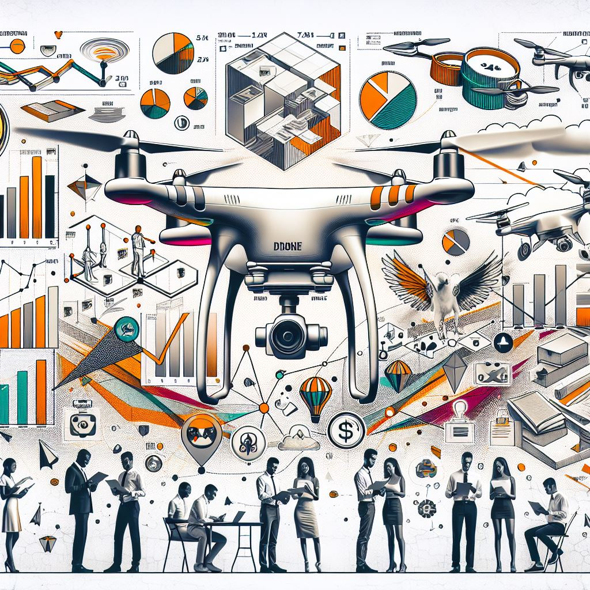
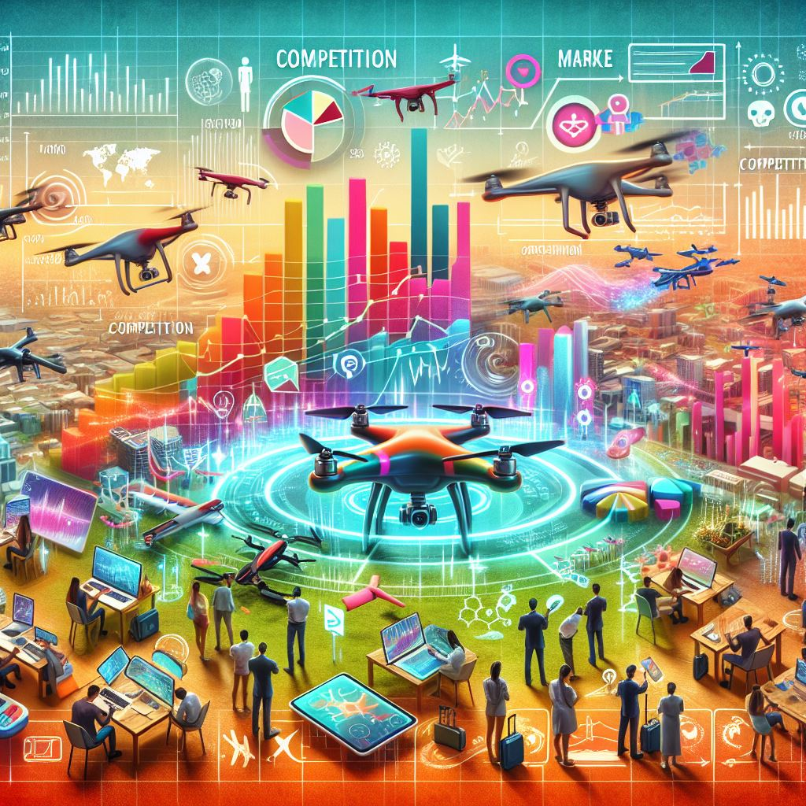
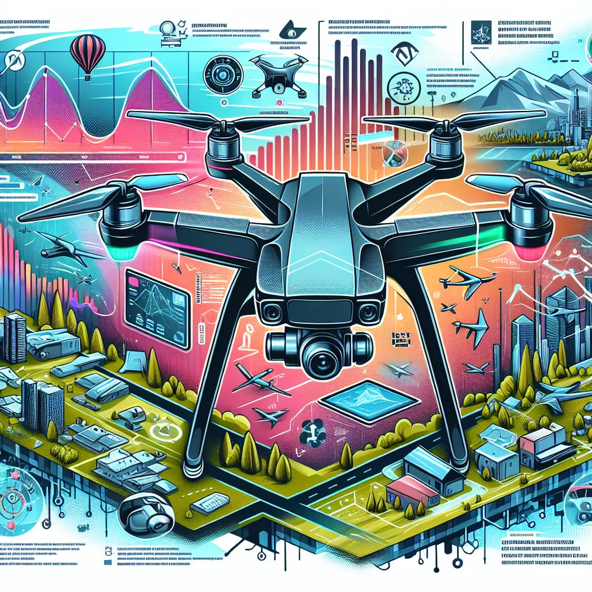
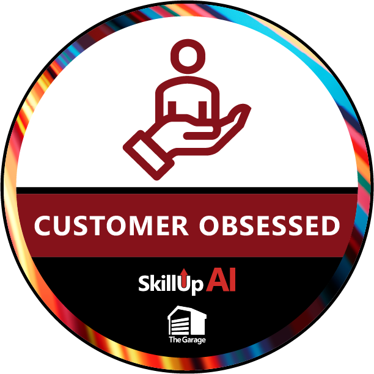

## Advanced Drone Solutions

Our advanced drone product offers cutting-edge imaging capabilities, extended flight times, and autonomous flying features. Designed for both professional and consumer markets, it provides high-quality performance and ease of use, making it ideal for photographers, videographers, agricultural professionals, industrial inspectors, and tech enthusiasts.

### Drone Prototype - 1

### Drone Prototype - 2

### Drone Capabilities - 1

### Drone Capabilities - 2

### Drone Features - 1

### Drone Features - 2

### Drone Usecase - 1

### Drone Usecase - 2

### Watch the Advanced Drone Demo

### customer compete challenge Badge

