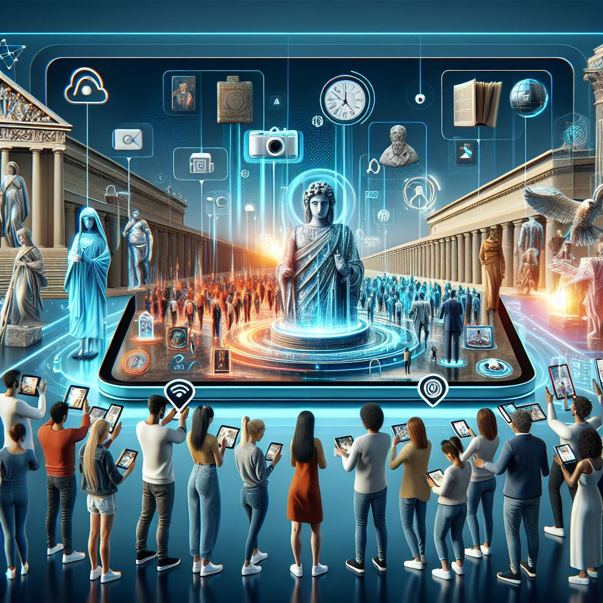
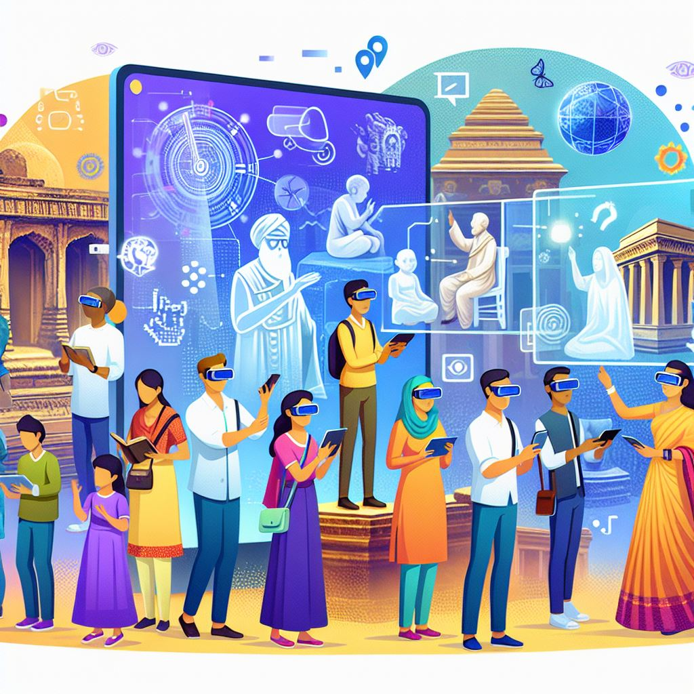
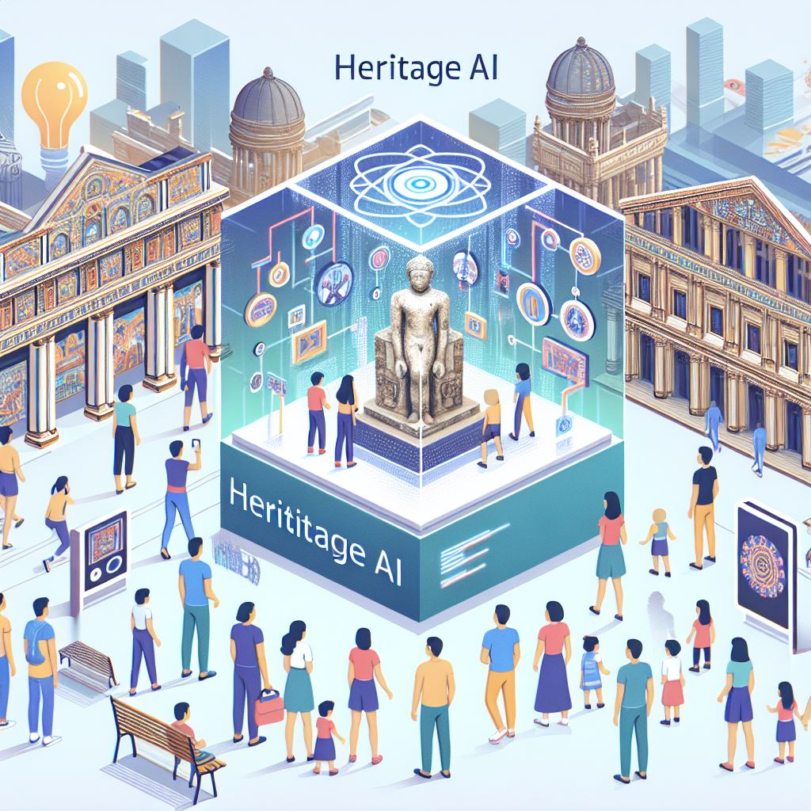
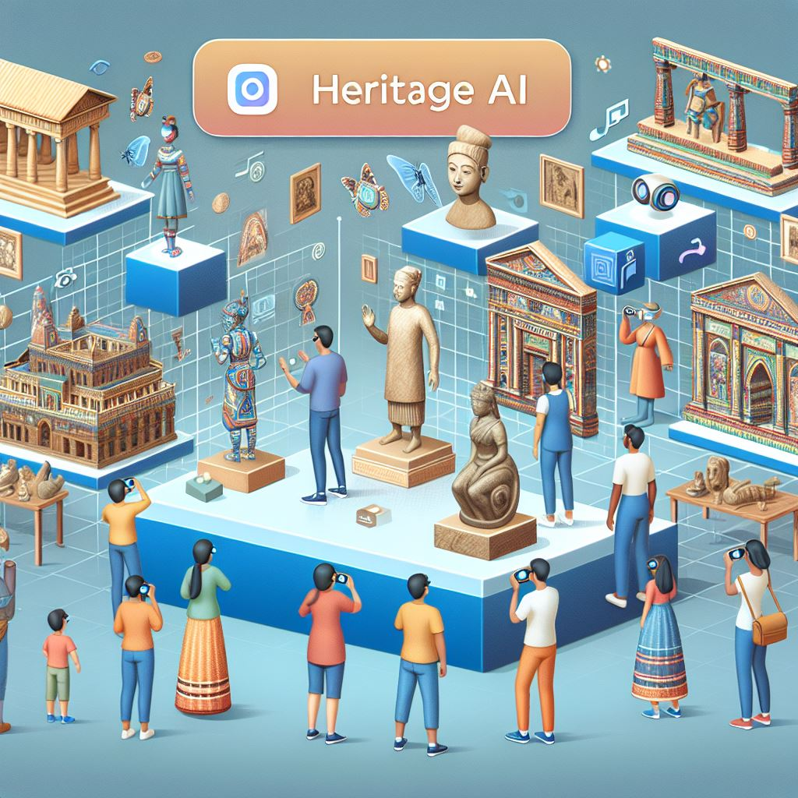

## Heritage AI

Heritage AI is an innovative platform that uses artificial intelligence to preserve and revitalize cultural heritage. By combining AI with augmented reality (AR), users can explore and interact with historical artifacts, monuments, and traditions in a modern, engaging way.

### Explore Heritage Artifacts

### Monument Exploration in AR

### Discover Traditions

### Watch the Heritage AI Demo

### Lean launch Badge

